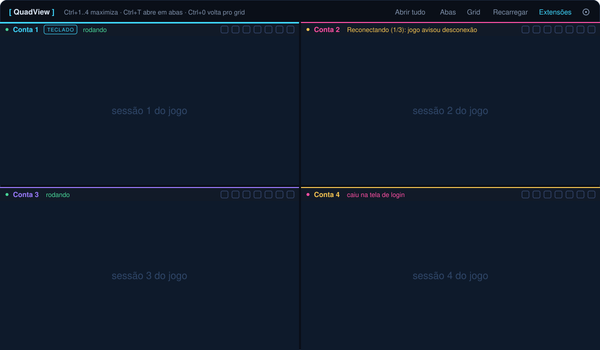
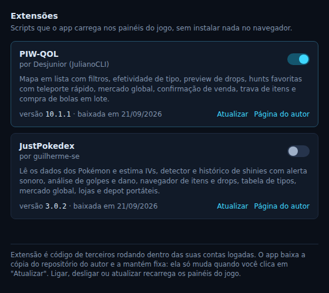
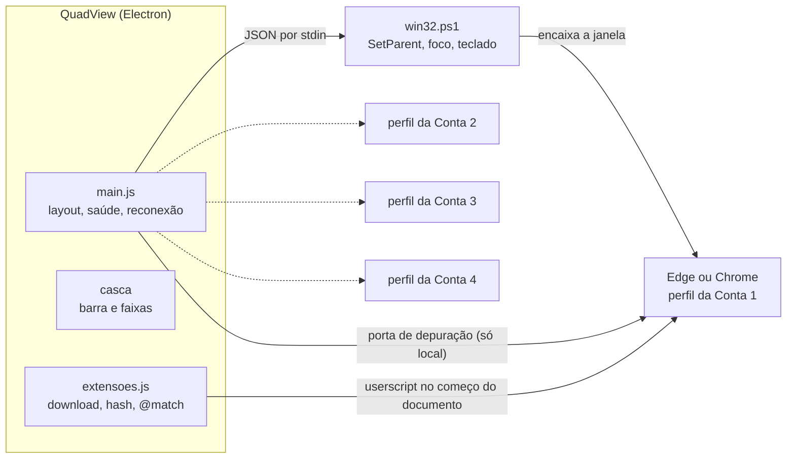

<p align="center">
  
</p>

<p align="center">
  
  
  
  
</p>

O QuadView abre até quatro sessões do [Poke Idle World](https://poke.idleworld.online) lado a lado, dentro de uma janela só. Cada painel é um navegador de verdade (Edge ou Chrome) com perfil próprio, então cada conta tem o seu login, o seu save e os seus cookies, sem uma enxergar a outra.

É um arquivo `.exe` portátil: baixar, dar dois cliques e jogar. Não instala nada no sistema nem no navegador.

<p align="center">
  
  <br><sub>Ilustração do layout. O miolo de cada painel é a janela do navegador com o jogo.</sub>
</p>

## Por que navegador de verdade

A primeira versão rodava o jogo dentro do próprio Electron, e a verificação "confirme que você é humano" barrava o login. Em vez de tentar enganar a verificação, o app passou a abrir o Edge ou o Chrome instalados na máquina e a encaixar a janela deles dentro da sua. Para o site, é uma pessoa usando o navegador dela, porque é exatamente isso.

## Funcionalidades

| | |
|---|---|
| **Quatro contas isoladas** | Um perfil de navegador por painel. Login, save e cookies separados. |
| **Grid 2x2 e abas** | Alterna entre os quatro painéis lado a lado e um painel em tela cheia por aba. Qualquer painel maximiza com um atalho. |
| **Abas extras** | [PIW Tools](https://piwtools.com.br/) e PokePedia já vêm configuradas. Dá para trocar ou adicionar até quatro. |
| **Abre sozinho** | Ao iniciar, o app já sobe todos os painéis na página do jogo. |
| **Login por painel** | Cada conta escolhe o seu jeito: usuário e senha, Entrar com Google, ou nada. |
| **Reconexão automática** | Percebe queda do jogo e recarrega o painel, até três vezes, avisando o motivo na faixa. |
| **Status por painel** | A faixa de cada conta mostra se está rodando, reconectando, na tela de login, sem internet ou travada. |
| **Indicador de teclado** | A etiqueta TECLADO mostra qual painel está recebendo o que você digita. |
| **Som por painel** | Silencia uma conta sem mexer nas outras. |
| **Soltar e encaixar** | Qualquer painel vira janela própria e volta para o grid com um clique. |
| **Extensões** | Userscripts da comunidade com liga e desliga, versão fixa e conferência de integridade. |
| **Senha protegida** | Credenciais cifradas pelo próprio Windows (DPAPI). Só o seu usuário do Windows decifra. |

## Instalação

1. Baixe o `QuadView.exe` na página de [Releases](../../releases/latest).
2. Coloque onde quiser (área de trabalho, por exemplo) e abra.

Requisitos: Windows 10 ou 11, com Microsoft Edge (já vem no sistema) ou Google Chrome.

O executável não é assinado digitalmente, então na primeira vez o Windows SmartScreen avisa que não reconhece o programa. Clique em **Mais informações** e depois em **Executar assim mesmo**. Se preferir não confiar num binário pronto, [rode pelo código](#rodar-pelo-código).

## Primeiro uso

1. Abra o app. Os quatro painéis sobem na página do jogo.
2. Na faixa colorida de cada painel, clique na **chave** e escolha como aquela conta entra.
3. Faça o primeiro login em cada painel.
4. Pronto. Nas próximas vezes o app abre tudo e adianta o login para você.

Na **engrenagem** ficam nome e URL de cada painel, abas extras, navegador usado, reconexão e o ajuste fino do recorte da barra do navegador.

## Atalhos

| Atalho | O que faz |
|---|---|
| `Ctrl` + `1` a `4` | Maximiza o painel (no modo abas, troca de aba) |
| `Ctrl` + `5` a `8` | Abre as abas extras |
| `Ctrl` + `T` | Alterna entre grid e abas |
| `Ctrl` + `0` | Volta para o grid 2x2 |
| Duplo clique na faixa | Maximiza ou restaura o painel |
| Clique na faixa | Entrega o teclado para aquele painel |

## Login automático, e onde ele para

Cada painel tem o seu método, escolhido na chave da faixa:

- **Usuário e senha**: o app preenche os dois campos na tela de login.
- **Entrar com Google**: o app clica no botão do Google uma vez.
- **Não fazer nada**: o app não toca na tela de login daquele painel.

O que o app **não** faz, de propósito:

- Não resolve nem contorna a verificação "confirme que você é humano". Ela continua sendo sua.
- Não clica em **Entrar**. Ele preenche, você confirma.
- Não digita nada em página do Google. Conta, senha e verificação em duas etapas são sempre com você.

Essa linha existe porque automatizar o envio do login é o tipo de coisa que rende banimento, e porque senha de conta Google não é assunto para um app de terceiros.

## Reconexão automática

O app acompanha a conexão do jogo (o WebSocket dele), o aviso de desconexão na tela, a internet do navegador e, opcionalmente, tela parada por mais de X minutos (5 por padrão). Quando detecta queda, recarrega o painel: até 3 tentativas, com 90 segundos entre elas, e o motivo aparece na faixa. Se não resolver, ele para e avisa que precisa de você.

Ele não simula atividade no jogo. O detector de tela parada serve para achar aba travada. Se o jogo pausa de propósito por inatividade, o certo é desligar essa opção na engrenagem.

## Extensões

<p align="center"></p>

O botão **Extensões** faz o papel de um Tampermonkey embutido: carrega userscripts da comunidade nos painéis do jogo, sem instalar extensão no navegador.

| Extensão | Autor | O que traz |
|---|---|---|
| [PIW-QOL](https://github.com/JulianoCLI/PIW-QOL) | Desjunior (JulianoCLI) | Mapa em lista com filtros, efetividade de tipo, preview de drops, hunts favoritas com teleporte rápido, mercado global, confirmação de venda, trava de itens, compra de bolas em lote. |
| [JustPokedex](https://github.com/guilherme-se/justpokedex) | guilherme-se | Dados dos Pokémon e estimativa de IV, detector e histórico de shinies, análise de golpes e dano, navegador de itens e drops, tabela de tipos, mercado, lojas e depot portáteis. |

Extensão é código de terceiros rodando dentro das suas contas logadas, então o app trata isso com cuidado:

- **O código dos autores não vem dentro do `.exe`.** Ao ligar uma extensão pela primeira vez, o app baixa a cópia direto do repositório do autor, por HTTPS.
- **Versão fixa.** A cópia baixada só muda quando você clica em **Atualizar**. Uma mudança no repositório do autor não entra nas suas contas sozinha.
- **Integridade conferida.** O app guarda o SHA-256 da cópia. Arquivo alterado por fora não roda.
- **Só script simples.** Aceita apenas userscript `@grant none`. Script que pede APIs especiais é recusado em vez de rodar pela metade.
- **Só no jogo.** As extensões entram nos painéis das contas, respeitando o `@match` de cada script, e nunca nas abas extras.

Todo o mérito das extensões é dos autores. Problema no comportamento de uma delas dentro do jogo deve ser relatado no repositório dela. Problema para carregar no QuadView, aqui.

As duas têm recursos parecidos (mercado, lojas, depot). Ligadas ao mesmo tempo, é de se esperar botões em dobro no jogo. Dá para desligar o recurso repetido nas opções de uma delas.

## Seus dados

Tudo fica em `%APPDATA%\quadview-solo`, no seu computador. O botão **Abrir pasta dos perfis**, na engrenagem, leva direto até lá.

| Item | Conteúdo |
|---|---|
| `perfis\` | Um perfil de navegador por conta (login, save, cookies). Apagar a pasta de um perfil zera só aquela conta. |
| `config.json` | Suas preferências. |
| `acessos.json` | Usuário e senha por painel, com a senha cifrada pelo Windows (DPAPI). |
| `extensoes\` | Cópias dos userscripts e o hash de cada uma. |

O app não tem servidor, não coleta nada e não envia nada para lugar nenhum. As únicas conexões que ele mesmo faz são o download das extensões, no GitHub dos autores, quando você pede.

Um detalhe técnico que vale saber: para controlar os painéis, o app abre cada navegador com uma porta de depuração que só aceita conexão de dentro do seu próprio computador. Enquanto o app está aberto, outro programa rodando na sua máquina poderia, em tese, se conectar a ela. É o mesmo nível de confiança de qualquer programa que você instala.

## Limitações conhecidas

- **Só Windows.** O encaixe de janelas usa a API do Windows.
- **Botão "Continuar como..." do Google.** Dentro do painel encaixado, o clique nesse botão não completa o login, e ainda não há correção. Vale tentar soltar o painel em janela própria (botão na faixa), entrar por lá e encaixar de volta, mas esse caminho ainda não foi confirmado. Contas com usuário e senha não têm esse problema.
- **Atalhos globais.** Enquanto o app está aberto, `Ctrl+T`, `Ctrl+0` e `Ctrl+1` a `8` são capturados por ele em qualquer programa.
- **Memória.** São quatro instâncias do jogo ao mesmo tempo, cerca de 1 GB por painel. Se a máquina apertar, reduza o número de painéis.
- **Sem assinatura digital.** Daí o aviso do SmartScreen na primeira execução.
- **Monitores com escalas diferentes.** Arrastar o app entre monitores com zoom diferente pode desalinhar um painel. O botão **Grid** reposiciona.
- **Painéis dividem a fila de entrada do Windows.** É o que faz o teclado funcionar dentro deles. Se o navegador de uma conta travar de vez, os outros painéis podem engasgar junto até ele voltar ou ser fechado.

## Rodar pelo código

Precisa de [Node.js](https://nodejs.org) LTS.

```bash
git clone <url-do-repositorio>
cd <pasta>
npm install
npm start
```

No Windows, o `iniciar.bat` faz os dois últimos passos sozinho.

Gerar o executável portátil:

```bash
npm run dist    # sai em dist/QuadView.exe
```

Publicar uma versão: crie uma tag `v1.2.3` e envie. O workflow em `.github/workflows` compila no Windows e anexa o `QuadView.exe` à Release.

### Testes

```bash
npm test                 # regras estáticas e testes de unidade, roda em qualquer sistema
npm run test:navegador   # injeção de extensão num Chromium de verdade
npm run test:e2e         # ponta a ponta, Linux com Xvfb, xdotool e x11-utils
```

O teste de ponta a ponta sobe um jogo falso que cai de propósito e confere abertura, encaixe, layout, reconexão, login por painel e extensões. As chamadas da API do Windows não rodam no Linux, então para elas existe um conjunto de regras estáticas (`test/win32-guard.js`) que trava cada correção já feita, com o motivo escrito ao lado.

## Como funciona



O app abre um navegador por perfil, acha a janela criada e a transforma em janela filha da sua. O controle (estado, recarregar, preencher login, extensões) vai pela porta de depuração do navegador, sem extensão instalada. O detalhe de cada decisão, incluindo os tropeços que viraram regra de teste, está em [docs/ARQUITETURA.md](docs/ARQUITETURA.md).

## Avisos

Projeto independente, feito por fã. Não é afiliado, endossado nem mantido pela equipe do Poke Idle World, pelo PIW Tools ou pelos autores das extensões. Pokémon e os nomes relacionados são marcas de Nintendo, Creatures Inc. e GAME FREAK inc.

Jogar com várias contas ao mesmo tempo pode ou não ser permitido pelas regras do jogo. Confira antes de usar. A responsabilidade pelo uso é de quem usa.

## Licença

[MIT](LICENSE). Use, modifique e redistribua, mantendo o aviso de copyright.
